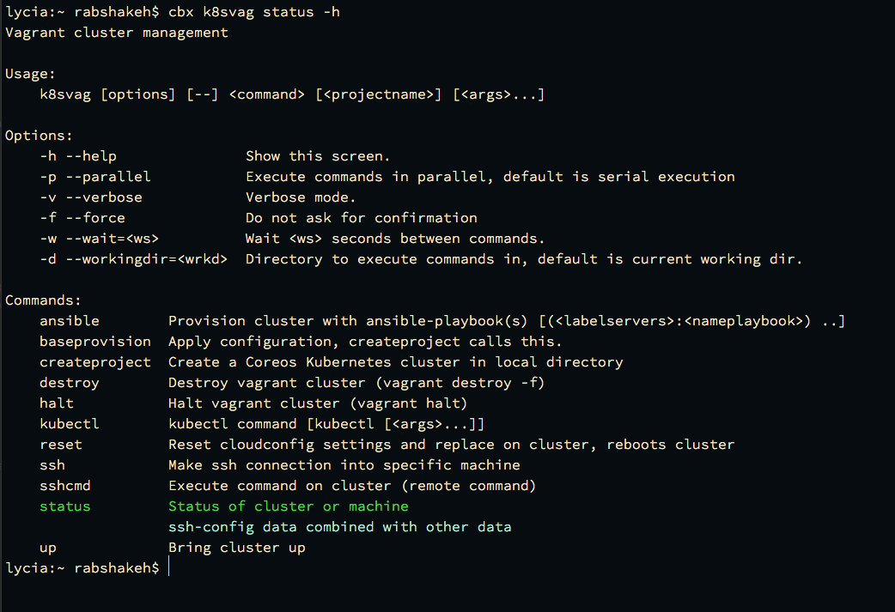

# arguments
Argument parser based on docopt


##install
```bash
pip install arguments
```

##help highlighted
Setting custom help is easy, override from the BaseArgument class and call set_command_help

```python
self.set_command_help("status", "ssh-config data combined with other data")
```

##screenshot


##usage
Docopt is used for parsing the docstring (__doc__), arguments bundles the schema parser and returns a OptionParser like object with normalized attributes

For example
```python
# coding=utf-8
"""
arguments test

Usage:
  tests.py [options] <posarg1> <posarg2>

Options:
  -h --help                     Show this screen.
  -o --option=<option1>         An option.
  --opt2=<option2>              An option [default: hello].
  -p --parameter=<parameter>    Folder to check the git repos out [default: 77].
  -v --verbose                  Folder from where to run the command [default: .].
"""

from arguments import Arguments

def main():
    """
    main
    """
    arg = Arguments()
    print(arg)


if __name__ == "__main__":
    main()
```

gives

```bash
$ python main.py pval1 pval2
<arguments.Arguments object at 0x1022e0eb8>
options :
    opt2 : hello
    option : None
    parameter : 77
    help : False
    verbose : False
positional :
    posarg1 : pval1
    posarg2 : pval2
```

***

##usage with classes
####[(examples/classbased.py)](examples/classbased.py)
A nested docker style commandline program  (python3)

```python
class BaseArguments(arguments.Arguments):
    def __init__(self, doc):
        ...

class MainArguments(BaseArguments):
    def __init__(self):
        doc = """
            Some tools.
            Usage:
                classbased.py [options] [--] <tool> [<args>...]

            Options:
                -h --help       Show this screen..
                -v --verbose    Verbose mode.

            Commands:
                tool1   Tool1 description here
                tool2   Tool2 ...
        """
        super().__init__(doc)


class Tool1Arguments(BaseArguments):
    def __init__(self):
        doc = """
            Tool 1
            Usage:
                classbased.py tool1 [options] [--] <command> [<args>...]

            Options:
                -h --help       Show this screen..
                -v --verbose    Verbose mode.

            Commands:
                run     Run the tool
                build   Build the tool
        """
        super().__init__(doc)


class Tool2Arguments(BaseArguments):
    def __init__(self):
        doc = """
            Tool 2
            Usage:
                classbased.py tool2 [options] [--] <command> [<args>...]

            Options:
                -h --help       Show this screen..
                -v --verbose    Verbose mode.

            Commands:
                upload  Upload something
                delete  Delete something
        """
        super().__init__(doc)
```

---
###usage with classes output
#####[(examples/classbased.py)](examples/classbased.py)
---
```sh
$ python classbased.py 
Usage:
    classbased.py [options] [--] <tool> [<args>...]
```
```sh
$ python classbased.py -h
Some tools.
Usage:
    classbased.py [options] [--] <tool> [<args>...]

Options:
    -h --help       Show this screen..
    -v --verbose    Verbose mode.

Commands:
    tool1   Tool1 description here
    tool2   Tool2 ...
```
---
```sh
$ python classbased.py tool1
Usage:
    classbased.py tool1 [options] [--] <command> [<args>...]
```
```sh
$ python classbased.py tool1 -h
Tool 1
Usage:
    classbased.py tool1 [options] [--] <command> [<args>...]

Options:
    -h --help       Show this screen..
    -v --verbose    Verbose mode.

Commands:
    run     Run the tool
    build   Build the tool
```
---
```yaml
$ python classbased.py tool1 run
<__main__.Tool1Arguments object at 0x10d45cac8>
options:
    help: False
    verbose: False
positional:
    args: []
    command: run
```

***

##Using schema
Assume you are using **docopt** with the following usage-pattern:

```bash
my_program.py [--count=N] <path> <files>
```

and you would like to validate that `<files>` are readable, and that
`<path>` exists, and that `--count` is either integer from 0 to 5, or
`None`.

this is how you validate it using schema:

```python
>>> from arguments import *

>>> s = Schema({'<files>': [Use(open)],
...             '<path>': os.path.exists,
...             '--count': Or(None, And(Use(int), lambda n: 0 < n < 5))})

>>> args = Arguments(validateschema=s)

>>> args.files
[<open file 'LICENSE-MIT', mode 'r' at 0x...>, <open file 'setup.py', mode 'r' at 0x...>]

>>> args.path
'../'

>>> args.count
3
```

As you can see, it validated data successfully, opened files and
converted `'3'` to `int`.